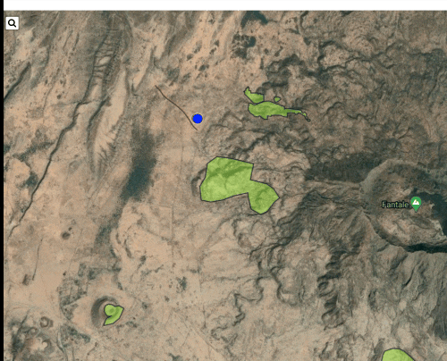

# leaflet-sidebar-tabless

A responsive sidebar _just_ for [Leaflet](http://leafletjs.com/). A fork of [leaflet-sidebar-v2](https://github.com/noerw/leaflet-sidebar-v2) with the tabs removed from the sidebars so that the sidebar can completely disappear into the sides and can be triggered to open using code.



## Why the Fork?
- When collapsed, the sidebar stays on the map as a full-height, 40px wide strip showing the tab icons. If you want a tab that totally disappears when it is not 'open' then this is exactly that!

## Usage

### API
leaflet-sidebar-tabless provides a simple API to dynamically modify the sidebar. All functions may be chained.

#### creation
The parameters object is fully optional. The default values are shown:

```js
var sidebar = L.control.sidebar({
    autopan: false,       // whether to maintain the centered map point when opening the sidebar
    closeButton: true,    // whether t add a close button to the panes
    container: 'sidebar', // the DOM container or #ID of a predefined sidebar container that should be used
    position: 'left',     // left or right
}).addTo(map);
```

#### modification

```js
/* add a new panel */
var panelContent = {
    id: 'userinfo',                     // UID, used to access the panel
    tab: '<i class="fa fa-gear"></i>',  // content can be passed as HTML string,
    pane: someDomNode.innerHTML,        // DOM elements can be passed, too
    title: 'Your Profile',              // an optional pane header
    position: 'bottom'                  // optional vertical alignment, defaults to 'top'
};
sidebar.addPanel(panelContent);

/* add an external link */
sidebar.addPanel({
    id: 'ghlink',
    tab: '<i class="fa fa-github"></i>',
    button: 'https://github.com/nickpeihl/leaflet-sidebar-tabless',
});

/* add a button with click listener */
sidebar.addPanel({
    id: 'click',
    tab: '<i class="fa fa-info"></i>',
    button: function (event) { console.log(event); }
});

/* remove a panel */
sidebar.removePanel('userinfo');

/* en- / disable a panel */
sidebar.disablePanel('userinfo');
sidebar.enablePanel('userinfo');
```

#### open / close / show content
```js
/* open a panel */
sidebar.open('userinfo');

/* close the sidebar */
sidebar.close();
```

#### remove sidebar

```js
/* remove the sidebar (keeping the sidebar container) */
sidebar.remove();
sidebar.removeFrom(map); // leaflet 0.x

/* to clear the sidebar state, remove the container reference */
sidebar._container = null
```

### markup
If you use the sidebar with static content only, you can predefine content in HTML:

```html
<div id="sidebar" class="leaflet-sidebar collapsed">
    <!-- Nav tabs -->
    <div class="leaflet-sidebar-tabs">
        <ul role="tablist"> <!-- top aligned tabs -->
            <li><a href="#home" role="tab"><i class="fa fa-bars"></i></a></li>
            <li class="disabled"><a href="#messages" role="tab"><i class="fa fa-envelope"></i></a></li>
            <li><a href="#profile" role="tab"><i class="fa fa-user"></i></a></li>
        </ul>

        <ul role="tablist"> <!-- bottom aligned tabs -->
            <li><a href="#settings" role="tab"><i class="fa fa-gear"></i></a></li>
        </ul>
    </div>

    <!-- Tab panes -->
    <div class="leaflet-sidebar-content">
        <div class="leaflet-sidebar-pane" id="home">
            <h1 class="leaflet-sidebar-header">
                sidebar-v2
                <div class="leaflet-sidebar-close"><i class="fa fa-caret-left"></i></div>
            </h1>
            <p>A responsive sidebar for mapping libraries</p>
        </div>

        <div class="leaflet-sidebar-pane" id="messages">
            <h1 class="leaflet-sidebar-header">Messages<div class="leaflet-sidebar-close"><i class="fa fa-caret-left"></i></div></h1>
        </div>

        <div class="leaflet-sidebar-pane" id="profile">
            <h1 class="leaflet-sidebar-header">Profile<div class="leaflet-sidebar-close"><i class="fa fa-caret-left"></i></div></h1>
        </div>
    </div>
</div>
```

You still need to initialize the sidebar (see API.creation)

### Events

The sidebar fires 3 types of events:
`opening`, `closing`, and `content`.
The latter has a payload including the id of the activated content div.

You can listen for them like this:
```js
sidebar.on('content', function(e) {
    // e.id contains the id of the opened panel
})
```


## License

leaflet-sidebar-tabless is free software, and may be redistributed under the [MIT license](LICENSE).
